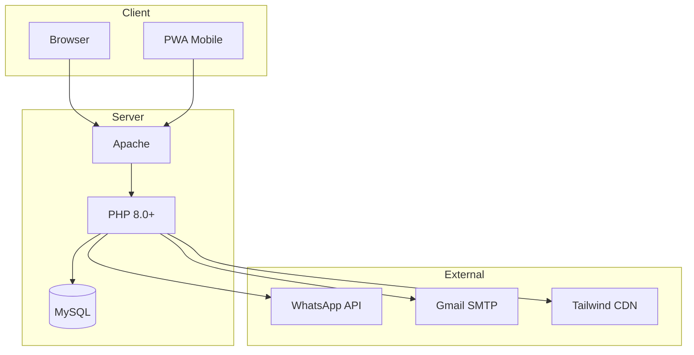
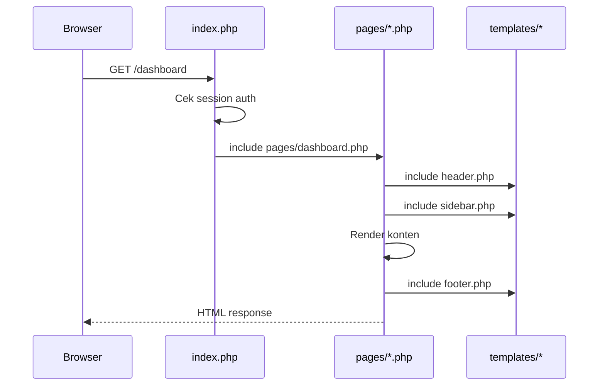
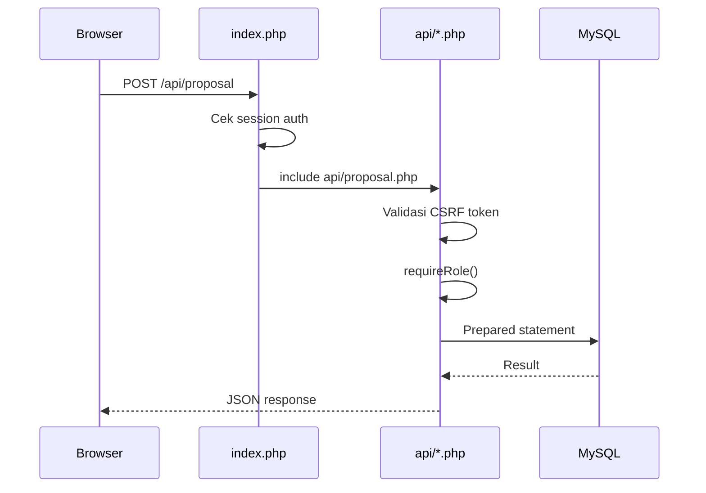
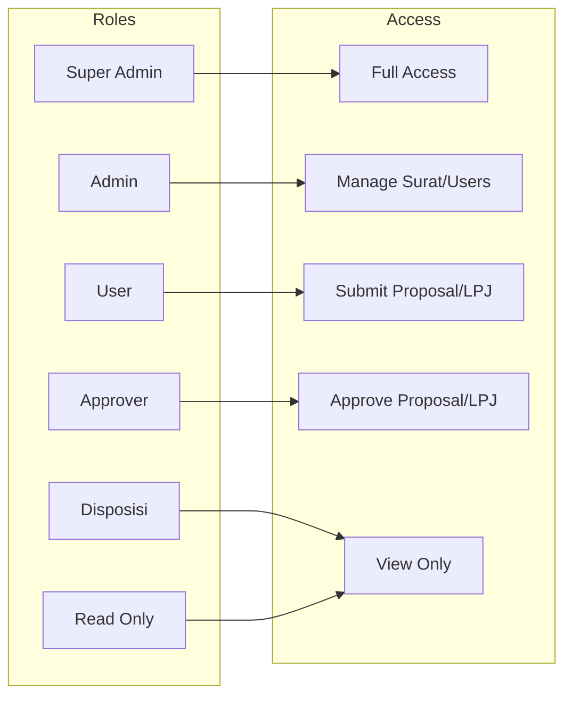
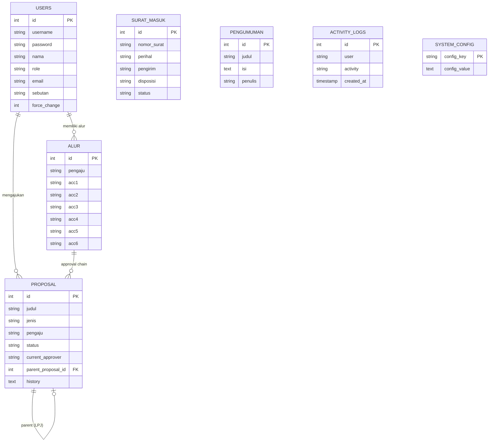
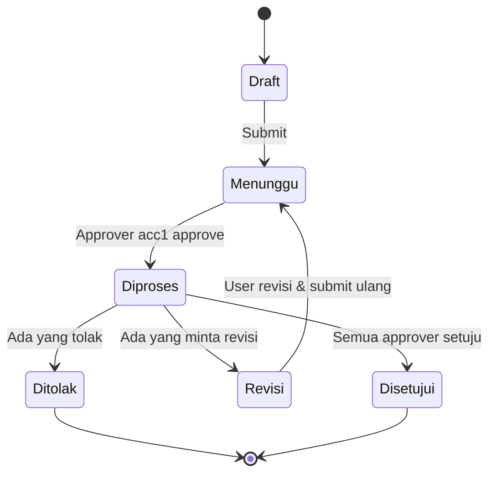
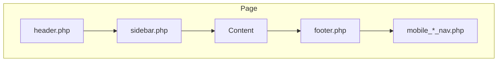
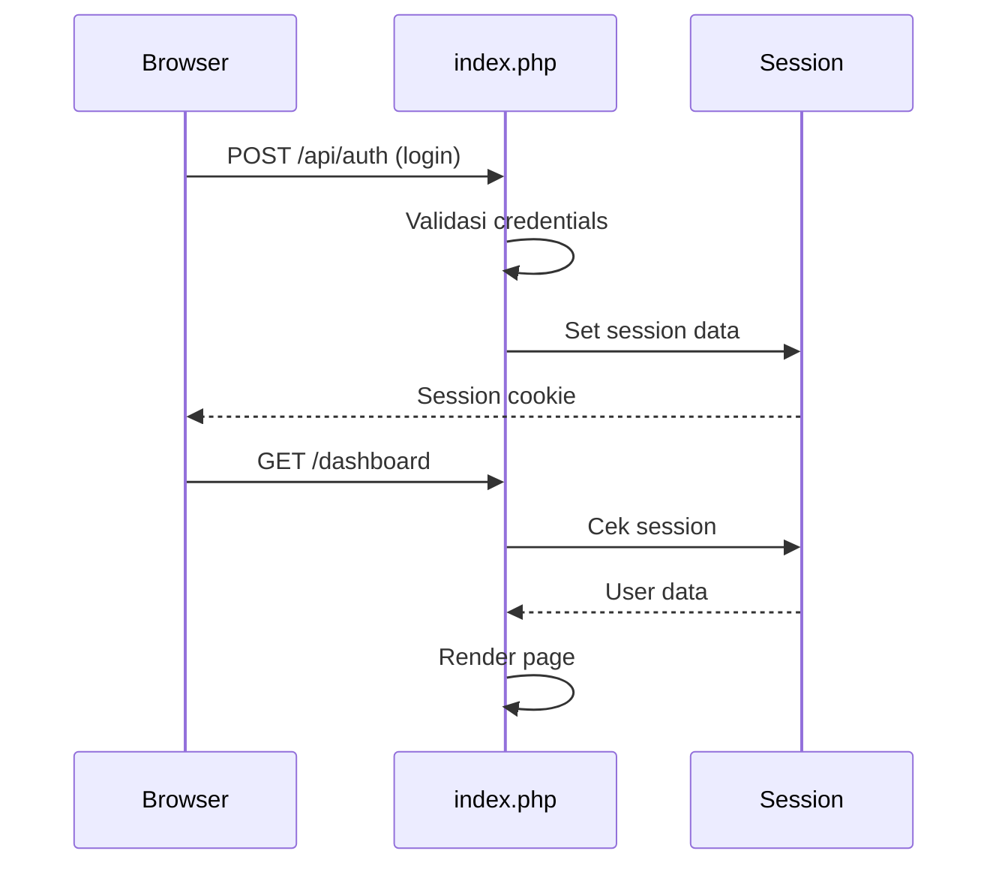
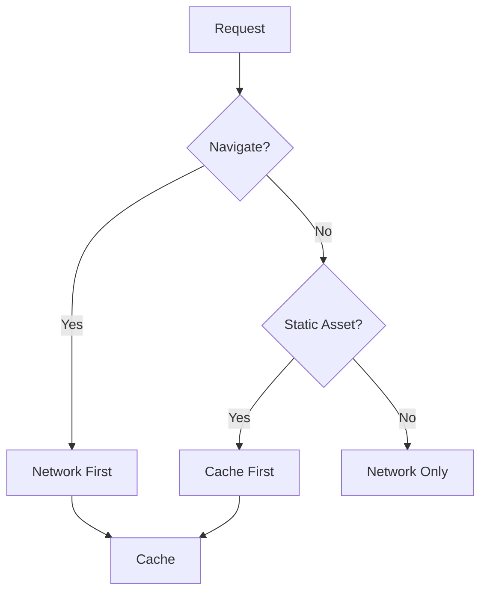

# Arsitektur LK UKMs

Dokumen ini menjelaskan arsitektur sistem LK UKMs secara detail.

## 1. Ringkasan Eksekutif

| Aspek | Detail |
|-------|--------|
| **Nama Project** | LK UKMs - Sistem Proposal & LPJ |
| **Stack** | PHP 8.0+ Native, MySQL/MariaDB |
| **Frontend** | Tailwind CSS, Font Awesome, Chart.js |
| **Database** | MySQL/MariaDB (utf8mb4) |
| **Server** | Apache dengan mod_rewrite |
| **Status** | Production |

### Prinsip Arsitektural

```
1. Native PHP tanpa framework — kontrol penuh atas kode
2. MVC-like pattern — Pages (View), API (Controller), Database (Model)
3. Session-based auth — tidak依赖 JWT atau OAuth
4. Prepared statements — keamanan SQL injection
5. Role-based access — kontrol akses per role
```

## 2. Diagram Arsitektur Tingkat Tinggi



## 3. Struktur Modul

```
lk.pjdigital.top/
├── index.php              # Entry point & router
├── api/                   # API endpoints (Controller)
├── pages/                 # View templates
├── templates/             # Shared layouts
├── includes/              # Core functions (Model/Helper)
├── config/                # Configuration
├── modals/                # Modal dialogs
├── public/                # Static assets
├── uploads/               # User files
└── scripts/               # Utility scripts
```

### Tanggung Jawab Modul

| Modul | Tanggung Jawab |
|-------|----------------|
| `index.php` | Routing, autentikasi dasar |
| `api/*.php` | Business logic, validasi, response JSON |
| `pages/*.php` | Rendering HTML, form handling |
| `templates/*.php` | Layout, navigasi, sidebar |
| `includes/*.php` | Helper functions, security, email |
| `config/*.php` | Database, konfigurasi |
| `public/*` | CSS, JS, icons |
| `uploads/*` | File user (proposal, surat, dll) |

## 4. Alur Request

### Alur GET Request



### Alur POST Request (API)



## 5. Sistem Role & Permission



### Matrix Permission

| Feature | Super Admin | Admin | User | Approver | Disposisi | Read Only |
|---------|:-----------:|:-----:|:----:|:--------:|:---------:|:---------:|
| Dashboard | ✅ | ✅ | ✅ | ✅ | ✅ | ✅ |
| Proposal | ✅ | ✅ | ✅ | ✅ | ❌ | ✅ |
| LPJ | ✅ | ✅ | ✅ | ✅ | ❌ | ✅ |
| Surat Masuk | ✅ | ✅ | ❌ | ❌ | ✅ | ✅ |
| Surat Keluar | ✅ | ✅ | ❌ | ❌ | ❌ | ❌ |
| Users | ✅ | ✅ | ❌ | ❌ | ❌ | ❌ |
| Pengumuman | ✅ | ✅ | ❌ | ❌ | ❌ | ❌ |
| Monitoring | ✅ | ✅ | ❌ | ❌ | ❌ | ❌ |
| System Settings | ✅ | ❌ | ❌ | ❌ | ❌ | ❌ |

## 6. Model Data

### Entity Relationship



### Tabel Utama

#### `users`
- Menyimpan data pengguna
- Password di-hash dengan bcrypt
- Field `force_change` untuk paksa ganti password

#### `proposal`
- Menyimpan proposal dan LPJ
- Dibedakan oleh field `jenis` (`Proposal` atau `LPJ`)
- `parent_proposal_id` menghubungkan LPJ ke proposal asal
- `history` menyimpan JSON riwayat approval

#### `alur`
- Menyimpan approval chain per pengaju
- acc1-acc6 adalah approver berurutan
- Approver bisa berupa username, role, atau nama

## 7. Approval Chain System



### Alur Approval

1. **User** submit proposal → status `Menunggu`
2. **Approver acc1** approve → status `Diproses`, current_approver → acc2
3. **Approver acc2** approve → current_approver → acc3
4. dst sampai acc6 (jika ada)
5. Semua approve → status `Disetujui`

### Normalisasi Approver

Gunakan `normalizeApprover()` untuk perbandingan:

```php
// Benar
if (normalizeApprover($currentApprover) === normalizeApprover($username)) {
    // Approver cocok
}

// Salah — tidak memperhatikan spasi/underscore
if (strtolower($currentApprover) === strtolower($username)) {
    // Bisa salah untuk "bem ftii" vs "bem_ftii"
}
```

## 8. Frontend Architecture

### Layout System



### Responsive Breakpoints

| Breakpoint | Layout | Navigasi |
|------------|--------|----------|
| >767px | Sidebar | Sidebar menu |
| ≤767px | Full-width | Bottom navigation |

### CSS Architecture

```
public/css/styles.css
├── Default styles (mobile-first)
├── @media (max-width: 767px) — Mobile styles
├── @media (pointer: coarse) — Touch device styles
└── @media (display-mode: standalone) — PWA styles
```

## 9. Security Model

### Authentication Flow



### CSRF Protection

```javascript
// Frontend — ambil token dari header.php
const csrfToken = window.csrfToken;

// Kirim dengan setiap POST request
fetch('/api/proposal', {
    method: 'POST',
    headers: { 'Content-Type': 'application/json' },
    body: JSON.stringify({
        csrf_token: csrfToken,
        // ... data lainnya
    })
});
```

### Enforcing Roles

```php
// Di setiap API handler
requireRole(['Admin', 'Super Admin']); // Array = salah satu
requireRole('Super Admin');            // String = exact match
```

## 10. PWA Architecture

### Service Worker Strategy



### Cache Versioning

- Format: `lkukms-pwa-v{number}`
- Update versi di `sw.js` untuk invalidate cache
- Cache lama dihapus otomatis pada activate event

## 11. Deployment

### Requirements

```
Server: Linux (Ubuntu/Debian recommended)
Web Server: Apache dengan mod_rewrite
PHP: 8.0+ dengan extensions: mysqli, mbstring, curl, gd
Database: MySQL 8.0+ atau MariaDB 10.4+
Composer: Untuk dependencies
```

### Build & Deploy

```bash
# Install dependencies
composer install

# Setup database
mysql -u root -p < config/schema.sql

# Konfigurasi database
nano config/database.php

# Set permissions
chmod -R 755 uploads/
chown -R www-data:www-data uploads/
```

## 12. Batasan & Future Work

| Saat Ini | Rencana |
|----------|---------|
| Single-server deployment | Docker containerization |
| Manual backup | Automated backup cron |
| Basic reporting | Advanced analytics |
| WhatsApp notifikasi | Multi-channel notifikasi |
| File-based uploads | Cloud storage integration |

## 13. Referensi File Kunci

| File | Topik |
|------|-------|
| `config/schema.sql` | Database schema |
| `includes/functions.php` | Core helper functions |
| `includes/security.php` | Auth & security helpers |
| `api/proposal.php` | Proposal & LPJ logic |
| `pages/proposal.php` | Proposal UI & actions |
| `public/css/styles.css` | Custom CSS & responsive |
| `sw.js` | Service worker & caching |

---

*Dokumen ini merefleksikan implementasi aktual per Juni 2026. Perbarui dokumen ini saat ada perubahan signifikan.*
